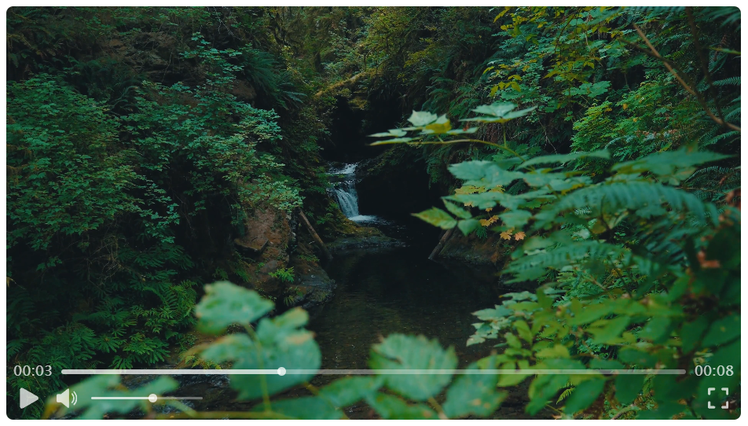

## Simple Video Player component

This is a simple video player component I made to learn a bit of React. Do whatever you like with it.

- <a href="https://www.flaticon.com/free-icons/play" title="play icons">Play icons created by Freepik - Flaticon</a>
- <a href="https://www.flaticon.com/free-icons/pause" title="pause icons">Pause icons created by Debi Alpa Nugraha - Flaticon</a>
- <a href="https://www.flaticon.com/free-icons/mute" title="mute icons">Mute icons created by Mayor Icons - Flaticon</a>
- <a href="https://www.flaticon.com/free-icons/speaker" title="speaker icons">Speaker icons created by Pixel perfect - Flaticon</a>
- <a href="https://www.flaticon.com/free-icons/full-screen" title="full-screen icons">Full-screen icons created by Uniconlabs - Flaticon</a>
- <a href="https://www.flaticon.com/free-icons/exit-fullscreen" title="exit fullscreen icons">Exit fullscreen icons created by Kreev Studio - Flaticon</a>

### Implemented features

- Play / Pause button
- Volume / Mute button
- Volume regulation
- Time progress display
- Clickable and draggable time progress bar
- Fullscreen
- Play / Pause video by clicking on it
- UI disappears with 3 seconds of inactivity
